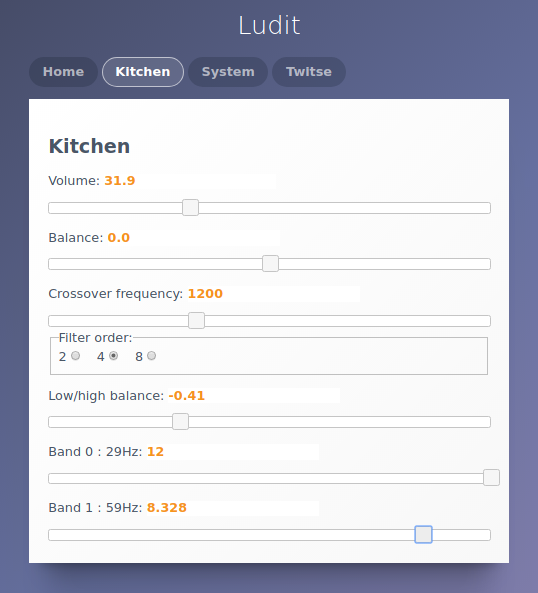

Ludit is an audio player system consisting of a wired raspberry pi server and wireless raspberry pi powered active stereo (as in two seperate) speakers running with hard time synchronization.

You probably don't want to know what that is all about. If all you are looking for a nice multi-room audio player with a proven track record and a lot of happy users then you should head over to e.g. [snapcast](https://github.com/badaix/snapcast). 

The initial reason for the Ludit project was to see if it was possible to replace normal speaker cables  either with local short mains cables, or just with thin uncritical cables to a power supply rather than speaker cables as with a normal power amplifier setup. 

Since the expectation is that nobody else will actually construct a system like this the question obviously is what this repository is then doing here in the first place. But thats quite easy to answer, hopefully someday someone will be happy to find a python gstreamer implementation of a two way audio crossover filter with delayed start, a working websocket client/server module or something else in the repository.

## Hard time synchronization
The 2 wireless raspberry pi computers are located in 2 separate right and left speakers in a stereo setup. Both rpi's are hardware modified and have their normal 19.2 MHz xtal replaced with a VCTCXO, a voltage controlled xtal oscillator. These VCTCXO's are controlled with the [twitse](https://github.com/bjerrep/twitse) client/server software. With this running both wireless rpi's are synchronized to each other typically within some +/- 20-30 microseconds. And synchronized means exactly that since the processors, buses and what not on the rpi's are now running a the same speed and are continuously tracking each other. This is a non-compromise solution to the problem of crystal drift over time between to separate computers if they should be in sync down to the actual hardware. As a consequence this audio player therefore have no concept of sample skipping, package dropping, re-sampling or anything that would be needed for correcting drift between speakers. Which in turn is why this player is useless to most.

## Bluetooth A2DP
Ludit is intended to be invisible and out of the way for normal users. It can currently play one thing only, bluetooth A2DP. Most likely driven by e.g. Spotify on a mobile. (It does a lot of buffering and can not be used for realtime audio). The server hosts a bluetooth dongle and a [BlueALSA](https://github.com/Arkq/bluez-alsa) -> [fork](https://github.com/bjerrep/bluez-alsa) delivers encoded audio (sbc/aac) for the ludit server.

## Processes

Here is a list of the Ludit specific processes running on the server and on the two clients in the ludit system. First the server:

### Server

**BlueALSA** ([github](https://github.com/Arkq/bluez-alsa))
If it wasn't for bluealsa this page would probably have looked quite different. Makes it a breeze to get a A2DP audio sink running (once Bluetooth is running that is).

**Ludit server** (python, this repository)
The server loads audio from BlueALSA and forwards it to the speaker clients over WiFi. It maintains the overall system configuration which it sends to the clients and can exchange with the system configuration webpage. The server is designed to be multi-room capable but so far Ludit have only seen a single group of speakers.

**Monitor** (python, this repository)
A system aware process that allows restarting e.g. Ludit and Twitse processes and rebooting the server and/or clients. Used by the webpage to get computer related metrics for server and clients.

**webpage** (jQuery, this repository)
A homepage that allows fine-tuning of the loudspeaker internals. The following image is for configuring a group (containing 2 stereo speakers). The source files are pure prototype implementations, don't go there. For anyone that has calculated and constructed a passive crossover and then thought it could be funny to move the crossover frequency 200 Hz then a slider probably sounds attractive. The webpage is client side only and connects to the Ludit server, Monitor server and the Twitse server via websockets.

### Clients

**Ludit client** (python, this repository)
Receives the raw stereo encoded A2DP audio, picks a channel to play and decodes it to a 2-way woofer and tweeter signal with gstreamer. The client is hardcoded to drive a 2-way speaker only. Audio is sent via ALSA to a DAC and finally a class D power amplifier where right channel is driving the woofer and left channel the tweeter. Or perhaps it is the other way around.

**Remote** (python, this repository)
Allows the Monitor to restart processes on the client and to get useless but geeky related information like cpu-temperature and such.

**Twitse** ([github](https://github.com/bjerrep/twitse))
Runs on both server and client to get their time in true sync. 

Some of the requirements for the whole enterprise are python 3, the python libs [connectable](https://github.com/timothycrosley/connectable) & [simple-websocket-server](https://github.com/dpallot/simple-websocket-server) and last but not least, gstreamer. 

