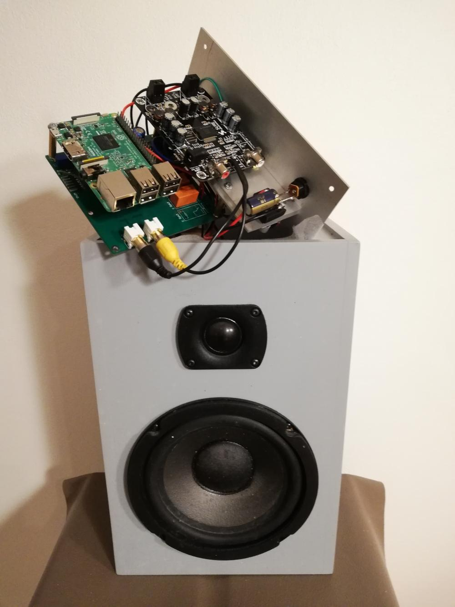

Ludit
=====

.. toctree::
   :maxdepth: 2
   :titlesonly:
   :caption: Contents:

   quick_start
   system_overview
   software_installations
   client_types
   server_audio_source_setup
   audio_processing
   rpi_setup
   client_audio_debugging

Introduction
============

Ludit is an audioplayer made for an wireless audio system using `Twitse <https://github.com/bjerrep/twitse/>`_ for time synchronisation. Ludit consists of a central wired server and seperate wireless stereo speakers where the server can act as e.g. a bluetooth A2DP headset for whatever music players that might run on whatever devices. Ludit does not have a music player app by itself.

Ludit requires the involved computers to be in hardware time sync since Ludit does not know how to correct audio with regard to crystal drift. The Twitse project is at least one way to keep computers in full hardware time sync over a WLAN.

Ludit is intended to get the best out of size constained loudspeakers in everyday setups. It is not too concerned about hifi but happily allows a heavy dose of electronic bass lift to get smaller loudspeakers play an acceptable bass on e.g. 3" or 4" bass drivers in 'small' (closed) enclosures. The price to pay is that Ludit speakers in such a setup are not really suited for playing insanely loud since the bass lift burns away quite some power used to battle the small enclosure without giving a equivivalent high sound pressure. But its nice to get the bass drum back. Obviously Ludit can just as well play through speakers that need no bass lift at all.

The following image shows one of two speakers made for the kitchen. It is very much in Ludits dna to play on two way systems where an electronic crossover can use right and left channel on a soundcard for tweeter and woofer. The carrier board underneath the raspberry pi is part of the twitse project although it sports a PCM5102A audio dac.

​    :alt: kitchen_speaker.jpg
​    :width: 300px

Links
===================

The Raspberry Pi: Audio out through I2S. Analysis of the native I2S from a raspberry pi which happens to be rather jitterish as it struggles to produce a 44.1 kHz samplerate. Be aware when  using syncroneous DACs:

http://www.dimdim.gr/2014/12/the-rasberry-pi-audio-out-through-i2s/

