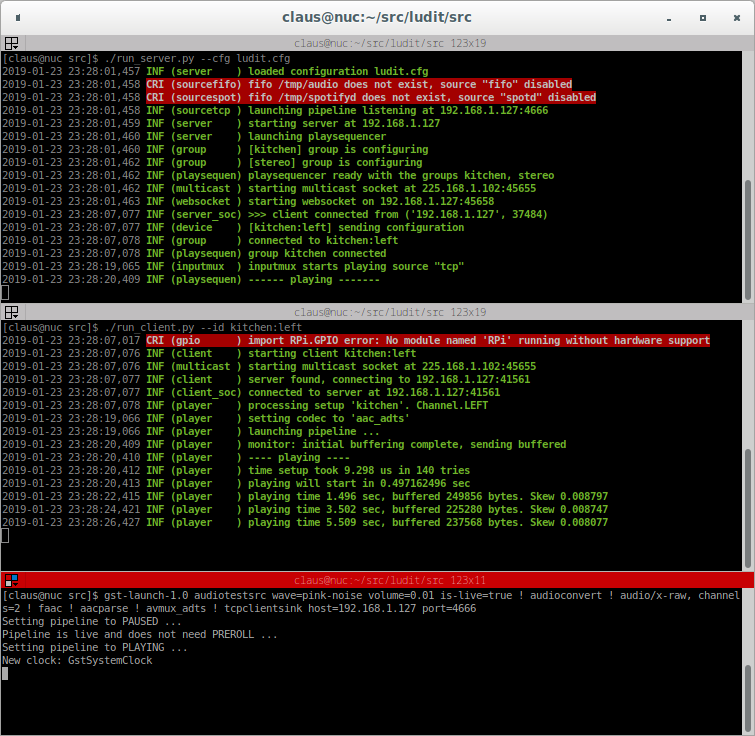
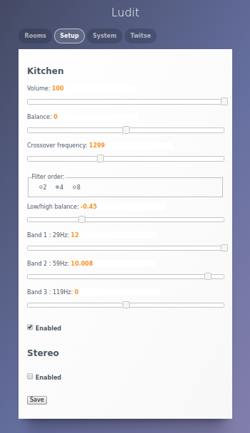

.. _quick_start:

###########
Quick start
###########

Probably the fastest and or simplest way to get Ludit playing is on a x86 PC. Most notably it skips the fancy audio sources and simply plays noise generated locally with gstreamer. Since everything will run on a single PC only one client is started as a second client might be unable to open Alsa. Regarding audio this means that only a single channel is playing (if two clients are running on the same default Alsa device this would have given a mono playback). Once the server and a client are running it will be possible to play with the audio settings such as crossover and equalizer via a webpage.

Note that since everything is running on a single computer there is no time drift to worry about (not that it would ever be an issue for a quick test run)

3 terminals will be needed so Terminator will come in handy in case you don't know it already. It will look like the following image, from top to bottom with the server, a client and a gstreamer pipeline.

A number of requirements are listed as 'Common installs' on the :ref:`software_installations` page. From the 'Server installs' simple-websocket-server is also needed.

Server
*******

Enter ./src. The first thing to do is to make a configuration file.

``./run_server.py --newcfg > ludit.cfg``

Have a look at the file, probably there is a group called 'kitchen' with two speakers caller 'left' and 'right'. These names will be needed for launching the clients. Now start the server:

``./run_server.py --cfg ludit.cfg``

Note that if the server and client(s) are running on different computers then only one NIC should be up on each. 

Client
*******

In a seperate terminal enter ./src and launch a client:

``./run_client.py --id kitchen:left``

Client and server should now have connected automatically (they discover each other via multicast).

Audio
******

In the third and last terminal launch the following gstreamer pipeline. Note that the volume is turned way down to prevent audio shock. Increase it to actually hear anything::

    gst-launch-1.0 audiotestsrc wave=pink-noise volume=0.01 is-live=true ! audioconvert ! audio/x-raw, channels=2 ! faac ! aacparse ! avmux_adts ! tcpclientsink host=<hostname or ip> port=4665

On the PC audio output the woofer signal will be in one channel and the tweeter signal in the other. It will sound horrible. The audiotestsrc source can be replaced with a gstreamer source playing a local file or streaming web radio if the noise gets too much.

Web
****

Finally go to ./web and make a copy of ludit_local.js.template called ludit_local.js and fill in the correct ip or hostname. Then open index.html in a webbrowser and the first two tabs should be operational as they connect directly to the Ludit server.

