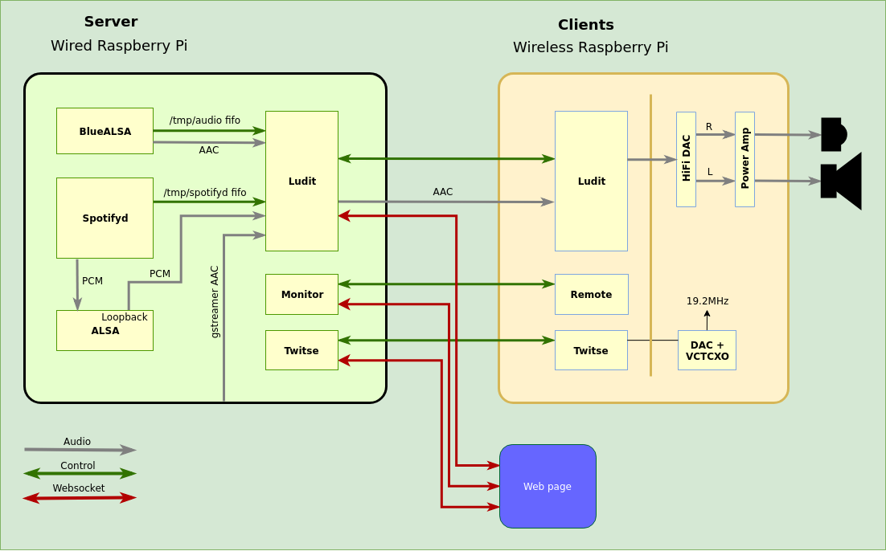

.. _system_overview:

#########################
System overview
#########################

The name Ludit is used with two different meanings, its the name of the audio player project and it is also used to describe the the entire audio player system (of which the audio player project is just a part).
The current complete Ludit audio system as it looks today is shown in the following image. There are the two main components, the server and the client, and the web page used for audio adjustments and status are shown as well.

An explanation is pending.
